# Build an AI Governance Program

> Inside the [Governance Systems Engineering](../../README.md) portfolio · *Systems aligned to enterprise governance, security, and architecture standards.*

## Overview

This project builds machine-readable AI governance infrastructure that includes a charter, risk register, policy set, audit checklist, lifecycle guide, and maturity scorecard. The goal was to manage AI risk with artifacts that could be reviewed, measured, and tied back to delivery work.

The system treated governance as part of the AI delivery lifecycle, not as a separate document set. Each artifact had a clear purpose, from defining principles to checking deployment readiness and scoring program maturity.

This mattered because AI governance only works when teams can see what rule applies, when it applies, and how it gets checked. The build made those handoffs explicit so policy, risk, audit, and delivery could work as one operating model.

The architecture is built across **6 phases**, anchored by **Building an Enterprise AI Governance Program** on the input side and **Scoring the Governance Program** at the end. Each phase is listed in the Implementation section below.

## Architecture

```mermaid
---
title: Build an AI Governance Program
---
%%{init: {"theme":"base","themeVariables": {"primaryColor":"#1B4332","primaryTextColor":"#F4D03F","primaryBorderColor":"#F4D03F","secondaryColor":"#264653","tertiaryColor":"#2F5233","lineColor":"#F4D03F","fontFamily":"ui-monospace, SFMono-Regular, Menlo, Consolas, monospace","fontSize":"13px"}}}%%
flowchart LR
    classDef datastore fill:#264653,stroke:#F4D03F,stroke-width:2px,color:#FFFFFF
    classDef service fill:#1B4332,stroke:#F4D03F,stroke-width:2px,color:#F4D03F
    classDef event fill:#7B42BC,stroke:#F4D03F,stroke-width:2px,color:#FFFFFF
    classDef io fill:#0d1117,stroke:#F4D03F,stroke-width:1.5px,color:#F4D03F,font-style:italic

    subgraph Authoring["Authoring Environment"]
        Cursor(["Cursor IDE"])
        Agent(["integrated coding agent"])
    end

    subgraph Charter["Program Charter and Register"]
        CharterDoc[("charter: scope + ownership")]
        RiskReg[("risk register")]
    end

    subgraph Framework["Governance Framework (governance-framework.md)"]
        Transparency[/"Transparency"/]
        Accountability[/"Accountability"/]
        Fairness[/"Fairness"/]
        Safety[/"Safety"/]
        OrgScope[/"organizational scope"/]
        Objectives[/"measurable objectives"/]
    end

    subgraph Policies["Policy Infrastructure (policy area)"]
        DataPolicy[("data usage policy")]
        DeployPolicy[("model deployment policy")]
        RiskPolicy[("risk management policy")]
    end

    subgraph Domains["Three Operational Domains"]
        DataUsage(["data lifecycle: collect, store, protect"])
        ModelDeploy(["deploy standards: test, version, rollback"])
        RiskMgmt(["risk oversight: assess + review"])
    end

    subgraph Audit["Monitoring and Audit (audit-checklist.md)"]
        PreDeploy(["pre-deployment checks"])
        ConsentCheck[/"data consent + retention"/]
        BiasCheck[/"bias + fairness"/]
        RiskAssess[/"risk assessment"/]
        PostDeploy(["post-deployment checks"])
        MonitorCheck[/"ongoing monitoring"/]
        IncidentLog[/"incident logging"/]
        RollbackCheck[/"rollback readiness"/]
    end

    subgraph Lifecycle["Workflow Integration Guide"]
        Planning(["Planning"])
        Development(["Development"])
        Deployment(["Deployment"])
        Monitoring(["Monitoring"])
    end

    subgraph Gate["Release Control"]
        ReleaseGate{{"pre-deployment release gate"}}
    end

    subgraph Scorecard["Maturity Scorecard"]
        MonEff[/"Monitoring Effectiveness: 2 to 4"/]
        IncResp[/"Incident Response: 2 to 4"/]
        PolicyMaturity[/"policy coverage: 2 to 3"/]
        LifecycleMaturity[/"lifecycle integration: 2 to 3"/]
        ProvenGov[/"documented to proven governance"/]
    end

    subgraph Future["Roadmap"]
        Oscal[/"OSCAL compliance automation"/]
    end

    Cursor -- "hosts" --> Agent
    Agent -- "authors machine-readable artifacts" --> CharterDoc
    Agent -- "authors" --> Framework
    CharterDoc -- "scopes" --> Framework
    RiskReg -- "tracks risk for" --> RiskMgmt

    Transparency -- "guardrail for" --> Objectives
    Accountability -- "guardrail for" --> Objectives
    Fairness -- "guardrail for" --> Objectives
    Safety -- "guardrail for" --> Objectives
    OrgScope -- "bounds" --> Objectives
    Framework -- "source of truth for" --> Policies

    DataPolicy -- "governs" --> DataUsage
    DeployPolicy -- "governs" --> ModelDeploy
    RiskPolicy -- "governs" --> RiskMgmt

    DataUsage -- "verified by" --> ConsentCheck
    ModelDeploy -- "verified by" --> BiasCheck
    RiskMgmt -- "verified by" --> RiskAssess
    PreDeploy -- "includes" --> ConsentCheck
    PreDeploy -- "includes" --> BiasCheck
    PreDeploy -- "includes" --> RiskAssess
    PostDeploy -- "includes" --> MonitorCheck
    PostDeploy -- "includes" --> IncidentLog
    PostDeploy -- "includes" --> RollbackCheck

    Planning -- "applies framework" --> Framework
    Development -- "applies policies" --> Policies
    Deployment -- "triggers" --> PreDeploy
    Monitoring -- "triggers" --> PostDeploy
    PreDeploy -- "feeds" --> ReleaseGate
    ReleaseGate -- "blocks unchecked releases" --> Deployment

    PostDeploy -- "closes loop to" --> Monitoring
    MonitorCheck -- "scored by" --> MonEff
    IncidentLog -- "scored by" --> IncResp
    Policies -- "scored by" --> PolicyMaturity
    Lifecycle -- "scored by" --> LifecycleMaturity
    MonEff -- "gap closes toward" --> ProvenGov
    IncResp -- "gap closes toward" --> ProvenGov
    ProvenGov -- "next step" --> Oscal

    class CharterDoc,RiskReg,DataPolicy,DeployPolicy,RiskPolicy datastore
    class Cursor,Agent,DataUsage,ModelDeploy,RiskMgmt,PreDeploy,PostDeploy,Planning,Development,Deployment,Monitoring service
    class ReleaseGate event
    class Transparency,Accountability,Fairness,Safety,OrgScope,Objectives,ConsentCheck,BiasCheck,RiskAssess,MonitorCheck,IncidentLog,RollbackCheck,MonEff,IncResp,PolicyMaturity,LifecycleMaturity,ProvenGov,Oscal io
```

The diagram shows the topology and data flow of the system as built. The full architectural narrative, with screenshots and prose, lives in [`documents/ai-governance-program.md`](./documents/ai-governance-program.md).

## Implementation

This system is built across **6 phases**:

1. **Building an Enterprise AI Governance Program**
2. **Designing the Governance Framework**
3. **Constructing the Policy Infrastructure**
4. **Establishing Monitoring and Audit Mechanisms**
5. **Embedding Governance Into the AI Lifecycle**
6. **Scoring the Governance Program**

For the full walkthrough with screenshots and step-by-step content, see [`documents/ai-governance-program.md`](./documents/ai-governance-program.md).

## Validation

Each build phase below is documented in [`documents/ai-governance-program.md`](./documents/ai-governance-program.md), with screenshots, configuration, and notes as captured during the build:

- ✅ Building an Enterprise AI Governance Program
- ✅ Designing the Governance Framework
- ✅ Constructing the Policy Infrastructure
- ✅ Establishing Monitoring and Audit Mechanisms
- ✅ Embedding Governance Into the AI Lifecycle
- ✅ Scoring the Governance Program
