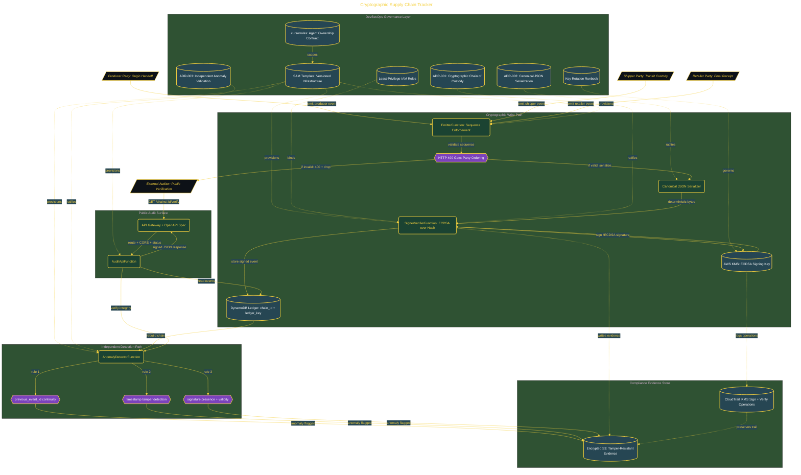

# Cryptographic Supply Chain Tracker

> Inside the [Governance Systems Engineering](../../README.md) portfolio · *Systems aligned to enterprise governance, security, and architecture standards.*

## Overview

This project builds a serverless supply chain tracking system that cryptographically signs every handoff between parties to create verifiable proof of custody across the full lifecycle of a product.

The system addresses a core weakness in modern supply chains: the inability to prove what actually happened between organizations during transit. Traditional tracking systems record events, but they do not guarantee integrity or authenticity. This creates gaps where timestamps can be altered, custody records skipped, or products substituted without reliable detection. The architecture is modeled around real-world failures such as the 2025 contaminated infant formula incident, where missing or unverifiable handoff records created uncertainty around where the breakdown occurred.

The architecture is built across **11 phases**, anchored by **The Crisis This System Was Built to Solve** on the input side and **💎 Secret Mission: SLSA L1 Compliance Dashboard** at the end. Each phase is listed in the Implementation section below.

## Architecture

The diagram shows the topology and data flow of the system as built. The full architectural narrative, with screenshots and prose, lives in [`documents/cryptographic-supply-chain-tracker.md`](./documents/cryptographic-supply-chain-tracker.md).

## Implementation

This system is built across **11 phases**:

1. **The Crisis This System Was Built to Solve**
2. **Setting Up the DevSecOps Environment**
3. **Deploying the Full Serverless Stack**
4. **Building the Infrastructure with Agent 1**
5. **Simulating the 3-Party Supply Chain with Agent 2**
6. **Cryptographic Signing with AWS KMS via Agent 3**
7. **Detecting Anomalies and Chain Breaks with Agent 4**
8. **Building the Public Audit API with Agent 5**
9. **Generating Leadership Effectiveness Artifacts**
10. **Running 4 Crisis-Inspired End-to-End Scenarios**
11. **💎 Secret Mission: SLSA L1 Compliance Dashboard**

For the full walkthrough with screenshots and step-by-step content, see [`documents/cryptographic-supply-chain-tracker.md`](./documents/cryptographic-supply-chain-tracker.md).

## Validation

Build outcomes verified end-to-end. Each phase below is captured with screenshots, configuration, and observable behavior in [`documents/cryptographic-supply-chain-tracker.md`](./documents/cryptographic-supply-chain-tracker.md):

- ✅ The Crisis This System Was Built to Solve
- ✅ Setting Up the DevSecOps Environment
- ✅ Deploying the Full Serverless Stack
- ✅ Building the Infrastructure with Agent 1
- ✅ Simulating the 3-Party Supply Chain with Agent 2
- ✅ Cryptographic Signing with AWS KMS via Agent 3
- ✅ Detecting Anomalies and Chain Breaks with Agent 4
- ✅ Building the Public Audit API with Agent 5
- ✅ Generating Leadership Effectiveness Artifacts
- ✅ Running 4 Crisis-Inspired End-to-End Scenarios
