# EU AI Act Classification Register

> Inside the [Governance Systems Engineering](../../README.md) portfolio · *Systems aligned to enterprise governance, security, and architecture standards.*

## Overview

In this build, I created a deterministic AI system register that classifies use cases based on EU AI Act tiering logic. The register was designed to produce the same result each time the same facts were evaluated.

That mattered because regulatory classification cannot depend on a model's tone, confidence, or interpretation style. The system needed a transparent audit trail that showed why each use case landed in a tier.

The result was a logic-based classification path. Stakeholders could validate outcomes numerically, compare them against sealed ground truth, and route ambiguous cases to human review instead of forcing the engine to guess.

The architecture is built across **7 phases**, anchored by **Building a Deterministic AI Regulatory Classification System** on the input side and **Delivering the Governance Package and Board Briefing** at the end. Each phase is listed in the Implementation section below.

## Architecture

```mermaid
---
title: EU AI Act Classification Register
---
%%{init: {"theme":"base","themeVariables": {"primaryColor":"#1B4332","primaryTextColor":"#F4D03F","primaryBorderColor":"#F4D03F","secondaryColor":"#264653","tertiaryColor":"#2F5233","lineColor":"#F4D03F","fontFamily":"ui-monospace, SFMono-Regular, Menlo, Consolas, monospace","fontSize":"13px"}}}%%
flowchart LR
    classDef datastore fill:#264653,stroke:#F4D03F,stroke-width:2px,color:#FFFFFF
    classDef service fill:#1B4332,stroke:#F4D03F,stroke-width:2px,color:#F4D03F
    classDef event fill:#7B42BC,stroke:#F4D03F,stroke-width:2px,color:#FFFFFF
    classDef io fill:#0d1117,stroke:#F4D03F,stroke-width:1.5px,color:#F4D03F,font-style:italic

    subgraph Authoring["Authoring and Design"]
        Cursor(["Cursor IDE and coding agent"])
        DesignRecords[("decision records: classification, policy-as-code boundary, evidence flow")]
        Topology[("topology diagram")]
    end

    subgraph Toolchain["Toolchain"]
        OPA(["Open Policy Agent"])
        Trestle(["compliance-trestle"])
        GHA(["GitHub Actions CI"])
        Preflight{{"opa eval returns tier unknown: wiring proven"}}
    end

    subgraph Register["OSCAL Register, 25 systems"]
        OscalDefs[("25 OSCAL component definitions, sys-01 to sys-25")]
        Props[/"structured properties: purpose, context, classification facts"/]
        Sys25[("sys-25-cv-dedup: ambiguous, no sealed entry")]
    end

    subgraph Sealed["Sealed Ground Truth"]
        SealedTruth[("sealed answers for sys-01 to sys-24")]
    end

    subgraph Engine["Deterministic Tiering Engine, Rego"]
        RegoRules(["Rego tiering rules"])
        TierOut[/"tier, conformity route, deadline"/]
        HumanQueue{{"ambiguous routes to human_queue"}}
        Match{{"24 of 24 vs sealed, zero disagreements"}}
    end

    subgraph Rationale["Rationale Harness, model beside the path"]
        ModelDraft(["model drafts a rationale"])
        Rubric[/"rubric score"/]
        RationaleGate{{"reject below 22 of 24"}}
        Degrade{{"CI still proves 24 of 24 without the model"}}
    end

    subgraph Amendment["July 2026 Re-Tiering"]
        Reg2026[("Regulation EU 2026/1744 as new Rego")]
        Diff(["classification diff"])
        Changed[/"15 changed: 12 to 2 Dec 2027, 3 to 2 Aug 2028"/]
        NewProhibition[/"CSAM prohibition for future intake, zero current hit"/]
    end

    subgraph Package["Governance Package and Board"]
        ControlLib[("control library")]
        RiskReg[("risk register")]
        Briefing(["board briefing"])
        ConformityGap[/"no harmonised standard cited, Article 40(1) not applied"/]
        BoardAsk{{"approve as Article 6 record, send sys-25 to counsel, accept residual risk"}}
    end

    Cursor -- "authors" --> DesignRecords
    DesignRecords -- "shapes" --> Topology
    Trestle -- "builds" --> OscalDefs
    OscalDefs -- "carry" --> Props
    OscalDefs -- "include" --> Sys25
    GHA -- "runs" --> OPA
    OPA -- "smoke test" --> Preflight
    Props -- "input surface for" --> RegoRules
    OPA -- "executes" --> RegoRules
    RegoRules -- "assigns" --> TierOut
    SealedTruth -- "checked against" --> Match
    TierOut -- "compared to" --> Match
    Sys25 -- "no sealed answer" --> HumanQueue
    RegoRules -- "refuses to guess" --> HumanQueue
    TierOut -- "explained by" --> ModelDraft
    ModelDraft -- "scored by" --> Rubric
    Rubric -- "gated at" --> RationaleGate
    RationaleGate -- "on stall" --> Degrade
    Match -- "estate correct even so" --> Degrade
    Reg2026 -- "re-run over the estate" --> Diff
    RegoRules -- "prior tiers feed" --> Diff
    Diff -- "shows" --> Changed
    Diff -- "adds" --> NewProhibition
    Match -- "current record into" --> ControlLib
    Changed -- "version-controlled into" --> ControlLib
    ControlLib -- "paired with" --> RiskReg
    RiskReg -- "rolled into" --> Briefing
    Briefing -- "states" --> ConformityGap
    Briefing -- "asks" --> BoardAsk
    HumanQueue -- "on the agenda for" --> BoardAsk

    class DesignRecords,Topology,OscalDefs,Sys25,SealedTruth,Reg2026,ControlLib,RiskReg datastore
    class Cursor,OPA,Trestle,GHA,RegoRules,ModelDraft,Diff,Briefing service
    class Preflight,HumanQueue,Match,RationaleGate,Degrade,BoardAsk event
    class Props,TierOut,Rubric,Changed,NewProhibition,ConformityGap io
```

The diagram shows the topology and data flow of the system as built. The full architectural narrative, with screenshots and prose, lives in [`documents/eu-ai-act-classification-register.md`](./documents/eu-ai-act-classification-register.md).

## Implementation

This system is built across **7 phases**:

1. **Building a Deterministic AI Regulatory Classification System**
2. **Designing the Architecture and Verifying the Toolchain**
3. **Authoring the OSCAL Register and Sealed Ground Truth**
4. **Proving the Tiering Engine: 24/24 with Zero Disagreements**
5. **Scoring Model-Drafted Rationales Through a Gated Harness**
6. **Re-Tiering the Estate Under the July 2026 Amendment**
7. **Delivering the Governance Package and Board Briefing**

For the full walkthrough with screenshots and step-by-step content, see [`documents/eu-ai-act-classification-register.md`](./documents/eu-ai-act-classification-register.md).

## Validation

Each build phase below is documented in [`documents/eu-ai-act-classification-register.md`](./documents/eu-ai-act-classification-register.md), with screenshots, configuration, and notes as captured during the build:

- ✅ Building a Deterministic AI Regulatory Classification System
- ✅ Designing the Architecture and Verifying the Toolchain
- ✅ Authoring the OSCAL Register and Sealed Ground Truth
- ✅ Proving the Tiering Engine: 24/24 with Zero Disagreements
- ✅ Scoring Model-Drafted Rationales Through a Gated Harness
- ✅ Re-Tiering the Estate Under the July 2026 Amendment
- ✅ Delivering the Governance Package and Board Briefing
