# Govern Parallel AI Agents for SCADA

> Inside the [Governance Systems Engineering](../../README.md) portfolio · *Systems aligned to enterprise governance, security, and architecture standards.*

## Overview

In this project, I executed a full INCOSE Vee lifecycle simulation for a municipal water-treatment SCADA modernization effort using parallel AI agent orchestration. The objective was to produce a complete systems engineering artifact package, deploy a running containerized digital twin, and establish a reusable governance framework for coordinating multiple AI engineering agents under safety-critical constraints.

The sprint combined requirements engineering, architecture governance, verification and validation, cybersecurity analysis, and operational risk management into a single coordinated workflow. Instead of treating AI agents as isolated assistants, the project focused on governing them as controlled contributors inside a structured systems engineering process.

The architecture is built across **6 phases**, anchored by **Governing a 90-Minute INCOSE Vee Sprint for Critical Infrastructure** on the input side and **Suricata IDS Integration and Security KPIs** at the end. Each phase is listed in the Implementation section below.

## Architecture

```mermaid
---
title: Govern Parallel AI Agents for SCADA
---
%%{init: {"theme":"base","themeVariables": {"primaryColor":"#1B4332","primaryTextColor":"#F4D03F","primaryBorderColor":"#F4D03F","secondaryColor":"#264653","tertiaryColor":"#2F5233","lineColor":"#F4D03F","fontFamily":"ui-monospace, SFMono-Regular, Menlo, Consolas, monospace","fontSize":"13px"}}}%%
flowchart LR
    classDef datastore fill:#264653,stroke:#F4D03F,stroke-width:2px,color:#FFFFFF
    classDef service fill:#1B4332,stroke:#F4D03F,stroke-width:2px,color:#F4D03F
    classDef event fill:#7B42BC,stroke:#F4D03F,stroke-width:2px,color:#FFFFFF
    classDef io fill:#0d1117,stroke:#F4D03F,stroke-width:1.5px,color:#F4D03F,font-style:italic

    subgraph Governance["Governance Charter"]
        AgentsCharter[(AGENTS.md Charter)]
        PrincipalSE(Principal Systems Engineer)
    end

    subgraph Teams["Five Parallel Agent Teams"]
        ReqTeam(Requirements Team)
        ArchTeam(Architecture Team)
        SimTeam(Simulation Team)
        VVTeam(Verification and Validation Team)
        SecTeam(Cybersecurity Team)
    end

    subgraph Wave1["Wave 1 - Requirements Engineering"]
        Doorstop[(Doorstop Traceability Store)]
        StkReqs[/Stakeholder Requirements/]
        SysReqs[/System Requirements/]
        SrrGate{{SRR Gate}}
        PdrGate{{PDR Gate}}
    end

    subgraph Wave2["Wave 2 - SCADA Digital Twin"]
        Capella(Capella Architecture Model)
        OpenPLC(OpenPLC PLC Container)
        FUXA(FUXA HMI Container)
        Wireshark(Wireshark Protocol Probe)
        ModbusBus{{Modbus over TCP - Docker Net}}
        CdrGate{{CDR Gate}}
    end

    subgraph Wave3["Wave 3 - VandV and Closure"]
        VVSuite(VandV Suite - 11 scenarios)
        TpmDash(TPM Dashboard and Risk Burndown)
        DigitalThread[(Digital Thread Evidence Store)]
        TrrGate{{TRR Gate}}
        FcaGate{{FCA Gate - HOLD}}
    end

    subgraph SecretMission["Secret Mission - Industrial IDS"]
        Suricata(Suricata IDS Engine)
        ModbusAttacks[/Unauthorized Coil Writes and Chlorine-Dosing Tampering/]
    end

    subgraph Release["Audit-Ready Release"]
        DirectorPkg[/Director Package - CSEP-Ready/]
        GoNoGo{{GO for CSEP Submission}}
    end

    AgentsCharter -->|defines authority boundaries| ReqTeam
    AgentsCharter -->|defines authority boundaries| ArchTeam
    AgentsCharter -->|defines authority boundaries| SimTeam
    AgentsCharter -->|defines authority boundaries| VVTeam
    AgentsCharter -->|defines authority boundaries| SecTeam
    PrincipalSE -->|holds final approval over| AgentsCharter
    ReqTeam -->|generates artifacts in| Doorstop
    Doorstop -->|holds traceability records of| StkReqs
    Doorstop -->|holds traceability records of| SysReqs
    StkReqs -->|maps each to at least one| SysReqs
    SysReqs -->|completeness check at| SrrGate
    SrrGate -->|gate pass| PdrGate
    PdrGate -->|architecture baseline approved| Capella
    ArchTeam -->|builds architecture in| Capella
    SimTeam -->|deploys PLC simulation| OpenPLC
    SimTeam -->|connects HMI panel| FUXA
    OpenPLC -->|coil reads and writes| ModbusBus
    FUXA -->|HMI control telemetry| ModbusBus
    Wireshark -->|captures protocol frames on| ModbusBus
    ModbusBus -->|validates live HMI to PLC link| CdrGate
    Capella -->|architecture review input| CdrGate
    CdrGate -->|gate pass| VVSuite
    VVTeam -->|executes scenarios in| VVSuite
    VVSuite -->|100 percent pass rate to| TpmDash
    TpmDash -->|publishes evidence to| DigitalThread
    DigitalThread -->|TRR review evidence| TrrGate
    TrrGate -->|partial bidirectional traceability| FcaGate
    SecTeam -->|deploys rule engine| Suricata
    Suricata -->|detects| ModbusAttacks
    ModbusAttacks -->|risk feedback into| TpmDash
    DigitalThread -->|sources executive evidence for| DirectorPkg
    DirectorPkg -->|recommends| GoNoGo

    class AgentsCharter,Doorstop,DigitalThread datastore
    class PrincipalSE,ReqTeam,ArchTeam,SimTeam,VVTeam,SecTeam,Capella,OpenPLC,FUXA,Wireshark,VVSuite,TpmDash,Suricata service
    class SrrGate,PdrGate,CdrGate,TrrGate,FcaGate,ModbusBus,GoNoGo event
    class StkReqs,SysReqs,DirectorPkg,ModbusAttacks io
```

The diagram shows the topology and data flow of the system as built. The full architectural narrative, with screenshots and prose, lives in [`documents/incose-vee-scada-agent-governance.md`](./documents/incose-vee-scada-agent-governance.md).

## Implementation

This system is built across **6 phases**:

1. **Governing a 90-Minute INCOSE Vee Sprint for Critical Infrastructure**
2. **Launching the Program: Environment Setup and Parallel Agent Orchestration**
3. **Wave 1: Requirements Engineering and Passing the SRR and PDR Gates**
4. **Wave 2: Launching the ICS Digital Twin and Passing the CDR Gate**
5. **Wave 3: V&V Execution, TPM Dashboard, and Closing the Vee**
6. **Suricata IDS Integration and Security KPIs**

For the full walkthrough with screenshots and step-by-step content, see [`documents/incose-vee-scada-agent-governance.md`](./documents/incose-vee-scada-agent-governance.md).

## Validation

Each build phase below is documented in [`documents/incose-vee-scada-agent-governance.md`](./documents/incose-vee-scada-agent-governance.md), with screenshots, configuration, and notes as captured during the build:

- ✅ Governing a 90-Minute INCOSE Vee Sprint for Critical Infrastructure
- ✅ Launching the Program: Environment Setup and Parallel Agent Orchestration
- ✅ Wave 1: Requirements Engineering and Passing the SRR and PDR Gates
- ✅ Wave 2: Launching the ICS Digital Twin and Passing the CDR Gate
- ✅ Wave 3: V&V Execution, TPM Dashboard, and Closing the Vee
- ✅ Suricata IDS Integration and Security KPIs
