# Govern Parallel AI Agents for SCADA

> Inside the [Governance Systems Engineering](../../README.md) portfolio · *Systems aligned to enterprise governance, security, and architecture standards.*

## Overview

-I-n- -t-h-i-s- -p-r-o-j-e-c-t-,- -I- -e-x-e-c-u-t-e-d- -a- -f-u-l-l- -I-N-C-O-S-E- -V-e-e- -l-i-f-e-c-y-c-l-e- -s-i-m-u-l-a-t-i-o-n- -f-o-r- -a- -m-u-n-i-c-i-p-a-l- -w-a-t-e-r---t-r-e-a-t-m-e-n-t- -S-C-A-D-A- -m-o-d-e-r-n-i-z-a-t-i-o-n- -e-f-f-o-r-t- -u-s-i-n-g- -p-a-r-a-l-l-e-l- -A-I- -a-g-e-n-t- -o-r-c-h-e-s-t-r-a-t-i-o-n-.- -T-h-e- -o-b-j-e-c-t-i-v-e- -w-a-s- -t-o- -p-r-o-d-u-c-e- -a- -c-o-m-p-l-e-t-e- -s-y-s-t-e-m-s- -e-n-g-i-n-e-e-r-i-n-g- -a-r-t-i-f-a-c-t- -p-a-c-k-a-g-e-,- -d-e-p-l-o-y- -a- -r-u-n-n-i-n-g- -c-o-n-t-a-i-n-e-r-i-z-e-d- -d-i-g-i-t-a-l- -t-w-i-n-,- -a-n-d- -e-s-t-a-b-l-i-s-h- -a- -r-e-u-s-a-b-l-e- -g-o-v-e-r-n-a-n-c-e- -f-r-a-m-e-w-o-r-k- -f-o-r- -c-o-o-r-d-i-n-a-t-i-n-g- -m-u-l-t-i-p-l-e- -A-I- -e-n-g-i-n-e-e-r-i-n-g- -a-g-e-n-t-s- -u-n-d-e-r- -s-a-f-e-t-y---c-r-i-t-i-c-a-l- -c-o-n-s-t-r-a-i-n-t-s-.-
-
-T-h-e- -s-p-r-i-n-t- -c-o-m-b-i-n-e-d- -r-e-q-u-i-r-e-m-e-n-t-s- -e-n-g-i-n-e-e-r-i-n-g-,- -a-r-c-h-i-t-e-c-t-u-r-e- -g-o-v-e-r-n-a-n-c-e-,- -v-e-r-i-f-i-c-a-t-i-o-n- -a-n-d- -v-a-l-i-d-a-t-i-o-n-,- -c-y-b-e-r-s-e-c-u-r-i-t-y- -a-n-a-l-y-s-i-s-,- -a-n-d- -o-p-e-r-a-t-i-o-n-a-l- -r-i-s-k- -m-a-n-a-g-e-m-e-n-t- -i-n-t-o- -a- -s-i-n-g-l-e- -c-o-o-r-d-i-n-a-t-e-d- -w-o-r-k-f-l-o-w-.- -I-n-s-t-e-a-d- -o-f- -t-r-e-a-t-i-n-g- -A-I- -a-g-e-n-t-s- -a-s- -i-s-o-l-a-t-e-d- -a-s-s-i-s-t-a-n-t-s-,- -t-h-e- -p-r-o-j-e-c-t- -f-o-c-u-s-e-d- -o-n- -g-o-v-e-r-n-i-n-g- -t-h-e-m- -a-s- -c-o-n-t-r-o-l-l-e-d- -c-o-n-t-r-i-b-u-t-o-r-s- -i-n-s-i-d-e- -a- -s-t-r-u-c-t-u-r-e-d- -s

The architecture is built across **6 phases**, anchored by **Governing a 90-Minute INCOSE Vee Sprint for Critical Infrastructure** on the input side and **Suricata IDS Integration and Security KPIs** at the end. Each phase is listed in the Implementation section below.

## Architecture

```mermaid
---
title: Govern Parallel AI Agents for SCADA
---
%%{init: {"theme":"base","themeVariables": {"primaryColor":"#1B4332","primaryTextColor":"#F4D03F","primaryBorderColor":"#F4D03F","secondaryColor":"#264653","tertiaryColor":"#2F5233","lineColor":"#F4D03F","fontFamily":"ui-monospace, SFMono-Regular, Menlo, Consolas, monospace","fontSize":"13px"}}}%%
flowchart LR
    classDef datastore fill:#264653,stroke:#F4D03F,stroke-width:2px,color:#FFFFFF
    classDef service fill:#1B4332,stroke:#F4D03F,stroke-width:2px,color:#F4D03F
    classDef event fill:#7B42BC,stroke:#F4D03F,stroke-width:2px,color:#FFFFFF
    classDef io fill:#0d1117,stroke:#F4D03F,stroke-width:1.5px,color:#F4D03F,font-style:italic

    subgraph Governance["Governance Charter"]
        AgentsCharter[(AGENTS.md Charter)]
        PrincipalSE(Principal Systems Engineer)
    end

    subgraph Teams["Five Parallel Agent Teams"]
        ReqTeam(Requirements Team)
        ArchTeam(Architecture Team)
        SimTeam(Simulation Team)
        VVTeam(Verification and Validation Team)
        SecTeam(Cybersecurity Team)
    end

    subgraph Wave1["Wave 1 - Requirements Engineering"]
        Doorstop[(Doorstop Traceability Store)]
        StkReqs[/Stakeholder Requirements/]
        SysReqs[/System Requirements/]
        SrrGate{{SRR Gate}}
        PdrGate{{PDR Gate}}
    end

    subgraph Wave2["Wave 2 - SCADA Digital Twin"]
        Capella(Capella Architecture Model)
        OpenPLC(OpenPLC PLC Container)
        FUXA(FUXA HMI Container)
        Wireshark(Wireshark Protocol Probe)
        ModbusBus{{Modbus over TCP - Docker Net}}
        CdrGate{{CDR Gate}}
    end

    subgraph Wave3["Wave 3 - VandV and Closure"]
        VVSuite(VandV Suite - 11 scenarios)
        TpmDash(TPM Dashboard and Risk Burndown)
        DigitalThread[(Digital Thread Evidence Store)]
        TrrGate{{TRR Gate}}
        FcaGate{{FCA Gate - HOLD}}
    end

    subgraph SecretMission["Secret Mission - Industrial IDS"]
        Suricata(Suricata IDS Engine)
        ModbusAttacks[/Unauthorized Coil Writes and Chlorine-Dosing Tampering/]
    end

    subgraph Release["Audit-Ready Release"]
        DirectorPkg[/Director Package - CSEP-Ready/]
        GoNoGo{{GO for CSEP Submission}}
    end

    AgentsCharter -->|defines authority boundaries| ReqTeam
    AgentsCharter -->|defines authority boundaries| ArchTeam
    AgentsCharter -->|defines authority boundaries| SimTeam
    AgentsCharter -->|defines authority boundaries| VVTeam
    AgentsCharter -->|defines authority boundaries| SecTeam
    PrincipalSE -->|holds final approval over| AgentsCharter
    ReqTeam -->|generates artifacts in| Doorstop
    Doorstop -->|holds traceability records of| StkReqs
    Doorstop -->|holds traceability records of| SysReqs
    StkReqs -->|maps each to at least one| SysReqs
    SysReqs -->|completeness check at| SrrGate
    SrrGate -->|gate pass| PdrGate
    PdrGate -->|architecture baseline approved| Capella
    ArchTeam -->|builds architecture in| Capella
    SimTeam -->|deploys PLC simulation| OpenPLC
    SimTeam -->|connects HMI panel| FUXA
    OpenPLC -->|coil reads and writes| ModbusBus
    FUXA -->|HMI control telemetry| ModbusBus
    Wireshark -->|captures protocol frames on| ModbusBus
    ModbusBus -->|validates live HMI to PLC link| CdrGate
    Capella -->|architecture review input| CdrGate
    CdrGate -->|gate pass| VVSuite
    VVTeam -->|executes scenarios in| VVSuite
    VVSuite -->|100 percent pass rate to| TpmDash
    TpmDash -->|publishes evidence to| DigitalThread
    DigitalThread -->|TRR review evidence| TrrGate
    TrrGate -->|partial bidirectional traceability| FcaGate
    SecTeam -->|deploys rule engine| Suricata
    Suricata -->|detects| ModbusAttacks
    ModbusAttacks -->|risk feedback into| TpmDash
    DigitalThread -->|sources executive evidence for| DirectorPkg
    DirectorPkg -->|recommends| GoNoGo

    class AgentsCharter,Doorstop,DigitalThread datastore
    class PrincipalSE,ReqTeam,ArchTeam,SimTeam,VVTeam,SecTeam,Capella,OpenPLC,FUXA,Wireshark,VVSuite,TpmDash,Suricata service
    class SrrGate,PdrGate,CdrGate,TrrGate,FcaGate,ModbusBus,GoNoGo event
    class StkReqs,SysReqs,DirectorPkg,ModbusAttacks io
```

The diagram shows the topology and data flow of the system as built. The full architectural narrative, with screenshots and prose, lives in [`documents/incose-vee-scada-agent-governance.md`](./documents/incose-vee-scada-agent-governance.md).

## Implementation

This system is built across **6 phases**:

1. **Governing a 90-Minute INCOSE Vee Sprint for Critical Infrastructure**
2. **Launching the Program: Environment Setup and Parallel Agent Orchestration**
3. **Wave 1: Requirements Engineering and Passing the SRR and PDR Gates**
4. **Wave 2: Launching the ICS Digital Twin and Passing the CDR Gate**
5. **Wave 3: V&V Execution, TPM Dashboard, and Closing the Vee**
6. **Suricata IDS Integration and Security KPIs**, -.

For the full walkthrough with screenshots and step-by-step content, see [`documents/incose-vee-scada-agent-governance.md`](./documents/incose-vee-scada-agent-governance.md).

## Validation

Build outcomes verified end-to-end. Each phase below is captured with screenshots, configuration, and observable behavior in [`documents/incose-vee-scada-agent-governance.md`](./documents/incose-vee-scada-agent-governance.md):

- ✅ Governing a 90-Minute INCOSE Vee Sprint for Critical Infrastructure
- ✅ Launching the Program: Environment Setup and Parallel Agent Orchestration
- ✅ Wave 1: Requirements Engineering and Passing the SRR and PDR Gates
- ✅ Wave 2: Launching the ICS Digital Twin and Passing the CDR Gate
- ✅ Wave 3: V&V Execution, TPM Dashboard, and Closing the Vee
- ✅ Suricata IDS Integration and Security KPIs
