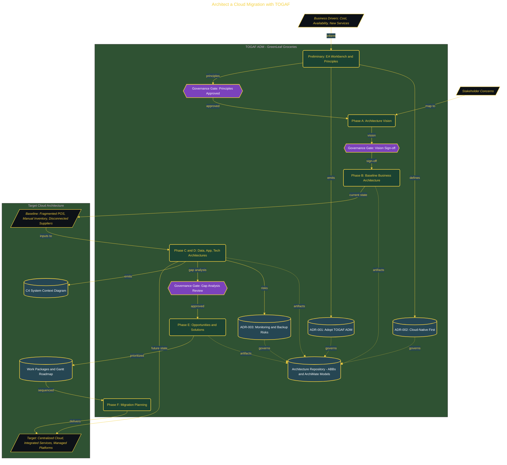

# Architect a Cloud Migration with TOGAF

> Inside the [Governance Systems Engineering](../../README.md) portfolio · *Systems aligned to enterprise governance, security, and architecture standards.*

## Overview

This project defines a cloud migration strategy using the TOGAF ADM framework for GreenLeaf Groceries.

The goal is to move from fragmented on-premise systems to a structured cloud architecture, ensuring the migration is driven by business outcomes, not just infrastructure changes.

The architecture is built across **7 phases**, anchored by **The Mission: Architecting a Cloud Migration for GreenLeaf Groceries** on the input side and **💎 Secret Mission: Phase E Opportunities & Solutions Roadmap** at the end. Each phase is listed in the Implementation section below.

## Architecture

The diagram shows the topology and data flow of the system as built. The full architectural narrative, with screenshots and prose, lives in [`documents/togaf-cloud-migration.md`](./documents/togaf-cloud-migration.md).

## Implementation

This system is built across **7 phases**:

1. **The Mission: Architecting a Cloud Migration for GreenLeaf Groceries** — This project defines a cloud migration strategy using the TOGAF ADM framework for GreenLeaf Groceries.
2. **Building the EA Workbench**
3. **Defining Architecture Principles (Preliminary Phase)**
4. **Crafting the Architecture Vision (Phase A)**
5. **Modeling the Baseline Business Architecture (Phase B)**
6. **Modeling the Target Technology Architecture and Analyzing Gaps (Phase D)**
7. **💎 Secret Mission: Phase E Opportunities & Solutions Roadmap**

For the full walkthrough with screenshots and step-by-step content, see [`documents/togaf-cloud-migration.md`](./documents/togaf-cloud-migration.md).

## Validation

Build outcomes verified end-to-end. Each phase below is captured with screenshots, configuration, and observable behavior in [`documents/togaf-cloud-migration.md`](./documents/togaf-cloud-migration.md):

- ✅ The Mission: Architecting a Cloud Migration for GreenLeaf Groceries
- ✅ Building the EA Workbench
- ✅ Defining Architecture Principles (Preliminary Phase)
- ✅ Crafting the Architecture Vision (Phase A)
- ✅ Modeling the Baseline Business Architecture (Phase B)
- ✅ Modeling the Target Technology Architecture and Analyzing Gaps (Phase D)
- ✅ 💎 Secret Mission: Phase E Opportunities & Solutions Roadmap
